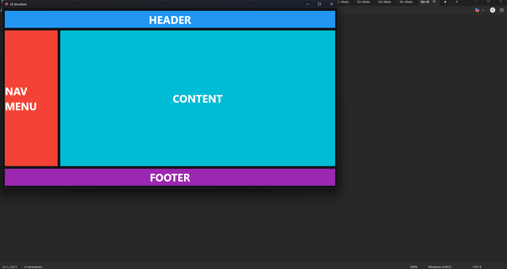
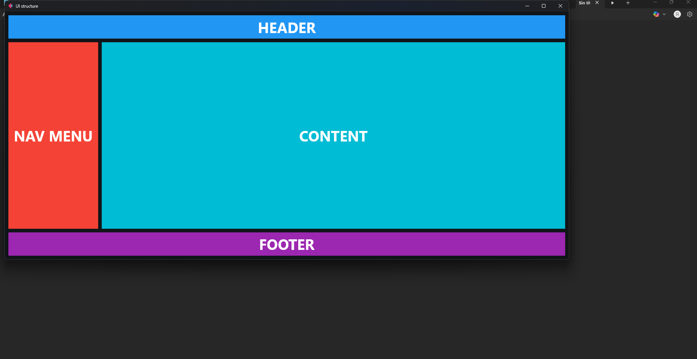

# Base UI Flet App 🧱

Base UI layout structure for building applications using the [Flet](https://flet.dev) framework.

Includes main containers for:
- Header (`TopContainer`)
- Sidebar (`SideBarContainer`)
- Footer (`BottomContainer`)
- Main content (`Content`) inside `PageContainer`

## Preview 🖼️

